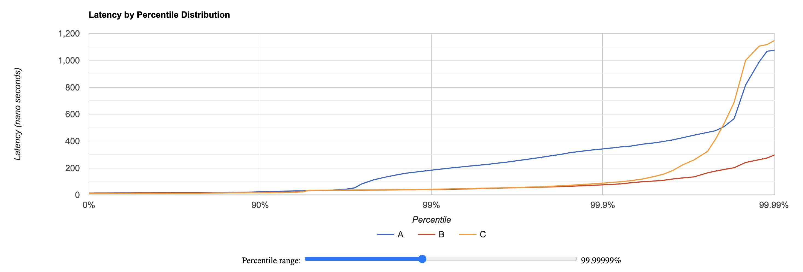

# HdrHistogram Widget

The purpose of this JavaScript widget is to easily visualize latencies recorded with HdrHistogram. The widget does not depend on any dependencies except HdrHistogramJS and hence may be used on any website.



## Usage

This library is packaged as a UMD module, hence you can use it directly
from JavaScript within a browser. To do so, you can simply include the bundle file from github's release page:

```html
<script src="https://github.com/HdrHistogram/HdrHistogramWidget/releases/download/v1.0.0/hdr-histogram-widget.umd.js"></script>
```

If you prefer using npm:

```sh
  npm i hdr-histogram-widget
```

Then you can use the HdrHistogramWidget class which provides a convenient static method _display()_:

```ts
import HdrHistogramWidget from "hdr-histogram-widget"; // not needed with the umd package

HdrHistogramWidget.display("HISTFAAAATR42i1M...");
```

You need to provide a base64 encoded histogram to this _display()_ method.

If you need to display several histograms, you need to provide an object as shown below:

```ts
HdrHistogramWidget.display({
  "Latencies for option1": "HISTFAAAATR42i1M...",
  "Latencies for option2": "HISTFAAAAXt42i1O...",
  "Latencies for option3": "HISTFAAAAXt42i1O...",
});
```

By default the graph is displayed within the _body_ of the page and the unit is 'milliseconds'. If the default behavior does not fit your needs, you can use two optionnal parameters:

```ts
const data = {
  'Latencies for option1': 'HISTFAAAATR42i1M...',
  ...
}
HdrHistogramWidget.display(
  data,
  'nano seconds',                   // default is milliseconds
  document.getElementById("graph")  // default is document.body
);
```
